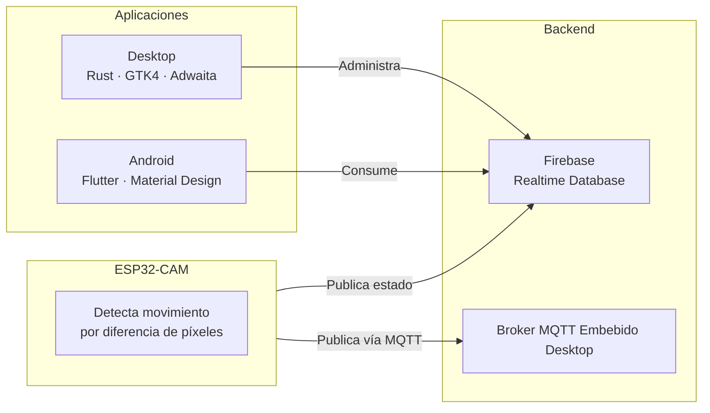

# Umbral

Sistema de monitorización en tiempo real del estado de aulas para la carrera de Tecnologías de la Información en la Universidad Estatal del Sur de Manabí (UNESUM).

Cada aula tiene un sensor ESP32-CAM que detecta movimiento mediante análisis de cuadros consecutivos. El estado (ocupado/libre) se publica vía Firebase Realtime Database y MQTT. Las aplicaciones de escritorio y móvil consumen estos datos para mostrar un tablero en vivo.

## Arquitectura



## Componentes

### `espcam/` — Firmware del sensor

Código Arduino para ESP32-CAM. Captura cuadros en escala de grises QQVGA y compara píxel a píxel contra el cuadro anterior. Si el porcentaje de píxeles cambiados supera el 15%, cambia el estado a ocupado. Publica el resultado en Firebase y opcionalmente vía MQTT. Incluye heartbeat cada 30s y reconexión automática.

Configuración vía `secret.h` (SSID, contraseña WiFi, API key Firebase, URL de Firebase, broker MQTT).

### `desktop/` — Aplicación de escritorio

App GTK4/Libadwaita en Rust. Muestra tarjetas de aulas con indicador de estado (verde = libre, rojo = ocupado, gris = offline), panel de noticias integrado, modo pantalla completa, y preferencias persistentes. Ideal para pantallas montadas en pared o recepción.

### `android/` — Aplicación móvil

App Flutter con Material Design. Misma información en un grid responsive con tarjetas que muestran nombre y estado del aula. Soporte para modo claro/oscuro según el tema del sistema.

## Stack técnico

| Capa | Tecnología |
|------|-----------|
| Sensores | ESP32-CAM, Arduino framework |
| Backend | Firebase Realtime Database |
| Mensajería | MQTT (brother local, canal secundario) |
| Desktop | Rust, GTK4, Libadwaita |
| Móvil | Flutter / Dart |

## Requisitos

- Rust toolchain (para desktop)
- Flutter SDK (para Android)
- Arduino CLI (para firmware)
- Firebase proyecto con Realtime Database

## Build

```sh
make desktop    # Compila y ejecuta app de escritorio
make android    # Compila y ejecuta app Android
make compile    # Compila firmware ESP32-CAM
make upload     # Compila y sube firmware a /dev/ttyUSB0
make monitor    # Monitor serie del ESP32-CAM
make flash      # upload + monitor
make package    # Package desktop .tar.gz para ARM64
make build      # Build APK release para ARM64
```

## Configuración de sensores

Cada ESP32-CAM necesita un archivo `espcam/secret.h` con:

```cpp
#define SECRET_SSID "tu_wifi"
#define SECRET_PASS "tu_contraseña"
#define FIREBASE_API_KEY "..."
#define FIREBASE_URL "https://tu-proyecto.firebaseio.com"
#define SECRET_MQTT_BROKER "ip_del_broker"
```

La cámara se registra automáticamente en Firebase con su dirección MAC como identificador. Desde la app de escritorio se añade el aula usando el botón **+** e ingresando el nombre y la MAC del sensor.
